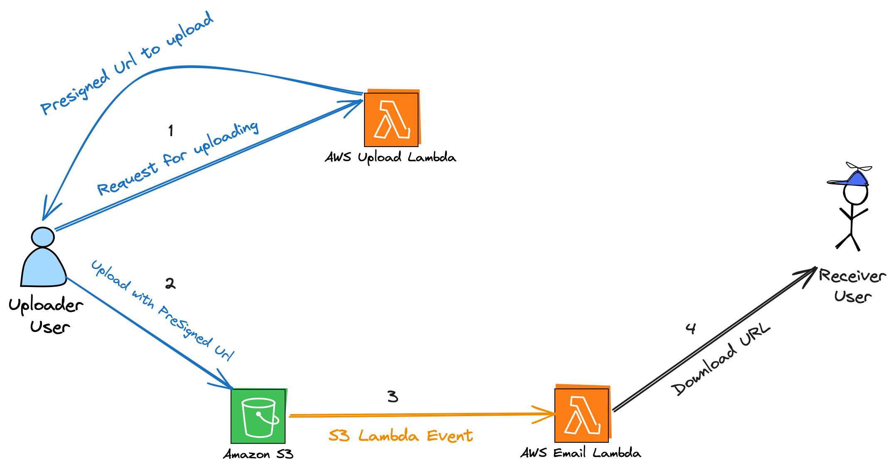

# WeTransfer Clone with Aws Serverless
It is a super simple serverless application that uses AWS Lambda, Amazon S3 and CDK

## Architecture

### Steps
1. Uploader user send request to Upload Lambda with Sender Email, Receiver Email and FileName (in Metadata). 
   So Upload Lambda returns a presigned url to the user. (for upload file to S3)

2. Uploader user upload file to S3 with presigned url.
3. S3 triggers Email Lambda with S3 Event Notification.
4. Email Lambda sends an email to Receiver Email with S3 Object Url.

## Deploy

    Publish projects to root folder

    publish/upload_lambda
    publish/email_lambda

    Run in the root folder
    cdk synth
    cdk deploy